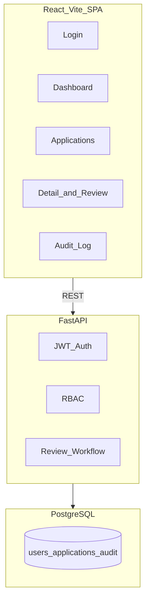

# eRIS Modernization Demo

Synthetic regulatory information system modernization demo for public-health / EFDA-style workflows. **Portfolio reference implementation only** — not a government production system, not connected to real eRIS, and uses synthetic data exclusively.

[](https://github.com/dawit-Tegegnwork/eris-modernization-demo/actions/workflows/test.yml)

**Requirements:** Python 3.12+, Node.js 22+, Docker (optional)

## Quick start

```bash
docker compose up --build
```

| Service | URL |
|---------|-----|
| Frontend | http://localhost:5180 |
| API | http://localhost:8010 |
| API docs | http://localhost:8010/docs |
| Health | http://localhost:8010/health |

### Demo in 3 minutes

1. Open http://localhost:5180
2. Login as `reviewer@demo.local` / `Demo123!`
3. View dashboard status counts
4. Open Applications → pick up a submitted application
5. Login as `admin@demo.local` → Audit Log

## Demo accounts

| Email | Password | Role |
|-------|----------|------|
| applicant@demo.local | Demo123! | applicant |
| reviewer@demo.local | Demo123! | technical_reviewer |
| admin@demo.local | Demo123! | admin |
| auditor@demo.local | Demo123! | auditor |

## Architecture



Full details: [docs/architecture.md](docs/architecture.md)  
Data model: [docs/data-model.md](docs/data-model.md)  
API reference: [docs/api-endpoints.md](docs/api-endpoints.md)  
RBAC matrix: [docs/rbac-matrix.md](docs/rbac-matrix.md)

## Features

- JWT authentication with role-based access control
- Regulatory application workflow: submit → technical review → clarification → approve/reject
- Document checklist metadata (no file upload)
- Status history timeline and comments
- Append-only audit trail with actor attribution
- Dashboard with status KPIs
- Health (`/health`) and readiness (`/ready`) endpoints
- Docker Compose with PostgreSQL
- Seed data with 6 synthetic applications
- Migration/stabilization documentation (GCP-to-local plan, checklists)
- Data validation and smoke test scripts

## Local development (without Docker)

### Backend

```bash
python -m venv venv && source venv/bin/activate
pip install -r requirements.txt -r requirements-dev.txt
cd backend && uvicorn main:app --reload --port 8000
```

### Frontend

```bash
cd frontend
npm install
VITE_API_URL=http://localhost:8000 npm run dev
```

## Docker commands

```bash
# Start all services
docker compose up --build

# Run in background
docker compose up --build -d

# View logs
docker compose logs -f api

# Stop
docker compose down

# Reset database
docker compose down -v && docker compose up --build
```

## Testing

```bash
# Backend tests
pip install -r requirements.txt -r requirements-dev.txt
pytest -q

# Data validation
python scripts/validate_data.py

# API smoke tests (API must be running)
bash scripts/smoke_test.sh

# Frontend build
cd frontend && npm run build
```

## Migration and stabilization docs

| Document | Purpose |
|----------|---------|
| [GCP-to-local migration plan](docs/migration/gcp-to-local-plan.md) | Phased cloud-to-on-prem migration |
| [Backup/restore](docs/operations/backup-restore.md) | pg_dump schedule and restore drill |
| [Logging/monitoring](docs/operations/logging-monitoring.md) | Structured logs and alerts |
| [Smoke test checklist](docs/checklists/smoke-test.md) | Post-deploy verification |
| [Release checklist](docs/checklists/release.md) | Pre-release gates |
| [Rollback checklist](docs/checklists/rollback.md) | Rollback procedure |

## What this proves for Palladium/Data.FI

- **Full-stack delivery:** React SPA + FastAPI REST API + PostgreSQL with Docker
- **Regulatory workflow:** Multi-step review pipeline matching eRIS-style submission/approval patterns
- **Security:** JWT auth, RBAC on every endpoint, audit trail with actor attribution
- **Migration readiness:** Documented GCP-to-local migration plan with data validation and rollback
- **Stabilization discipline:** Smoke tests, release/rollback checklists, health/readiness probes
- **Public-sector awareness:** Synthetic data only, truthful portfolio framing, no fake production claims

## Interview talking points

1. **Cloud-to-local migration:** Phased approach — infra parity, app containerization, data migration with validation, cutover with rollback window
2. **Workflow design:** State machine with role-gated transitions, status history for compliance, clarification loop
3. **Audit trail:** Every mutation records actor, entity, and metadata — queryable by admin/auditor only
4. **Release discipline:** Automated tests + smoke script + validation script before any deploy
5. **Scope honesty:** Demo uses synthetic EFDA-style data; real eRIS would add document storage, SSO, Alembic migrations, and integration with national ID systems

## Known limitations and next improvements

- No real eRIS or government system integration
- No document file upload/storage (checklist metadata only)
- No Alembic migrations (uses `create_all` for demo simplicity)
- No SSO/LDAP integration
- No email notifications for status changes
- No multi-tenant organization scoping
- Screenshots pending capture from running UI
- Production would need: rate limiting, WAF, secrets rotation, HA PostgreSQL, and formal penetration testing

## Synthetic data notice

All users, applications, organizations, and audit events are **synthetic demo data**. This project is a portfolio reference implementation for interview readiness — not deployed in any government environment.

## License

MIT — see [LICENSE](LICENSE)
