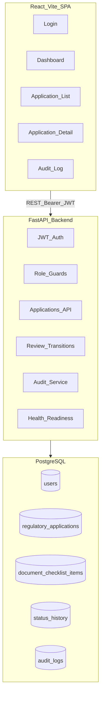
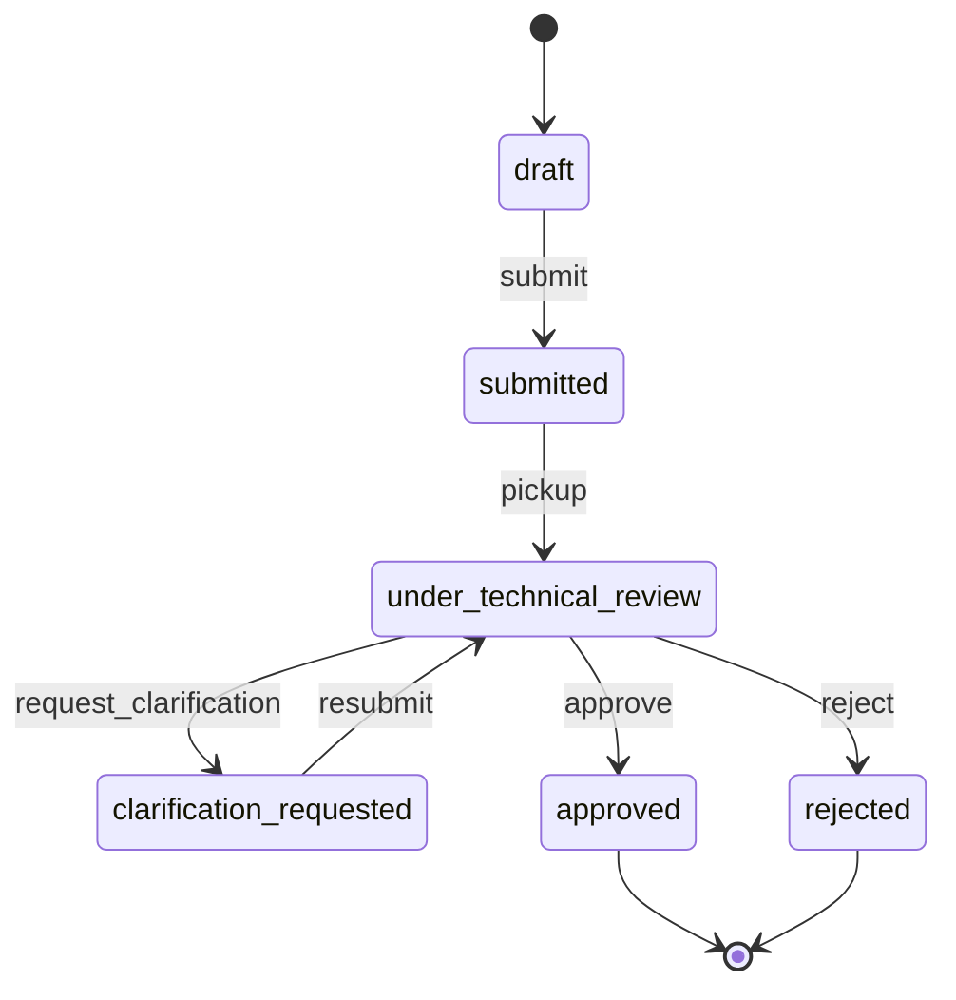

# Architecture

Synthetic regulatory information system modernization demo — portfolio reference implementation only.

## Components

| Layer | Technology | Responsibility |
|-------|------------|----------------|
| Frontend | React 19 + Vite + TypeScript | Login, dashboard, application workflow UI |
| API | FastAPI + SQLModel | REST endpoints, JWT auth, RBAC |
| Database | PostgreSQL 16 | Persistent storage for users, applications, audit |
| Ops | Docker Compose | Local full-stack run with health checks |

## Workflow

## Security model

- JWT bearer tokens (HS256) with configurable expiry
- Role-based access on every mutating endpoint
- Audit log records actor_id on all state changes
- CORS restricted to configured frontend origins
