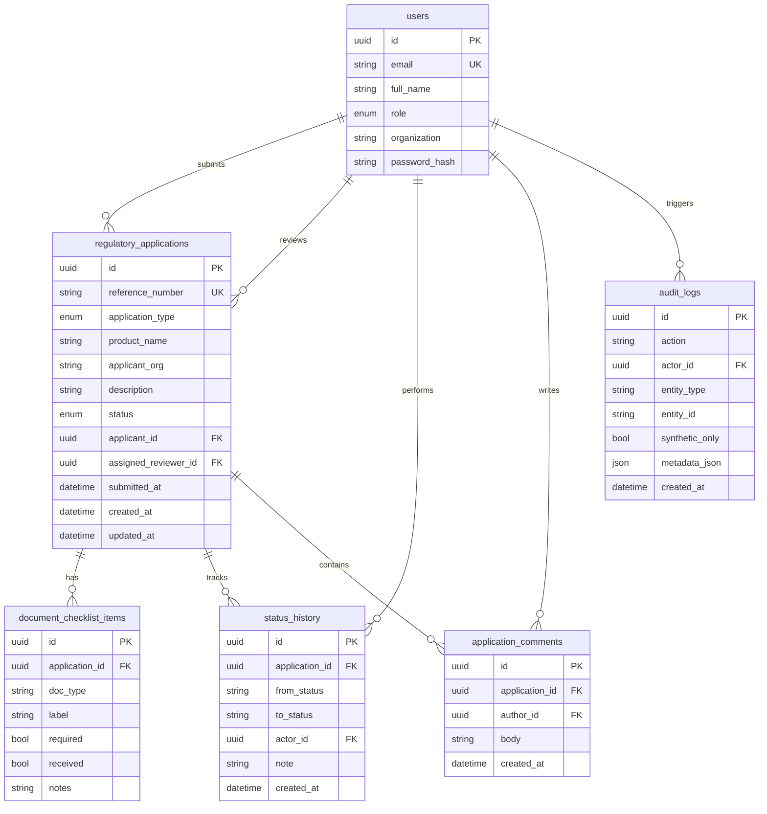

# Data model

## Application types

- `product_registration` — new pharmaceutical product dossier
- `import_permit` — import authorization for regulated products
- `gmp_certificate` — GMP facility certification
- `variation_amendment` — post-approval change request

## Status values

- `draft` — created but not submitted
- `submitted` — awaiting reviewer pickup
- `under_technical_review` — assigned reviewer evaluating
- `clarification_requested` — reviewer needs more information
- `approved` — regulatory decision: approved
- `rejected` — regulatory decision: rejected
