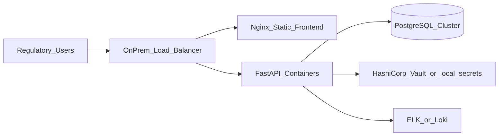

# GCP-to-local/private cloud migration plan

**Status:** Planning reference document for portfolio demo.  
**Scope:** Hypothetical migration of a cloud-hosted regulatory information system to on-premises or private-cloud infrastructure.  
**Not a claim** of an actual Palladium/Data.FI or EFDA production migration.

## 1. Current-state assumptions

| Component | Assumed cloud state |
|-----------|---------------------|
| API | Containerized FastAPI on GCP Cloud Run or GKE |
| Frontend | Static SPA on Cloud Storage + Cloud CDN |
| Database | Cloud SQL PostgreSQL |
| Secrets | GCP Secret Manager |
| Logs | Cloud Logging |
| CI/CD | GitHub Actions → Artifact Registry → Cloud Run |

## 2. Target on-premises topology

## 3. Migration phases

### Phase 0 — Discovery (2 weeks)
- Inventory all API endpoints, env vars, and external integrations
- Document data volumes, retention policies, and compliance requirements
- Identify cloud-specific dependencies (managed IAM, Cloud SQL extensions)

### Phase 1 — Infrastructure parity (3–4 weeks)
- Provision on-prem PostgreSQL with replication
- Set up container runtime (K8s or Docker Swarm) and private registry
- Configure TLS certificates, DNS, and firewall rules
- Establish secrets management and backup automation

### Phase 2 — Application migration (2–3 weeks)
- Containerize API and frontend (already done in this demo)
- Replace cloud env vars with on-prem equivalents (`ERIS_DATABASE_URL`, `ERIS_SECRET_KEY`)
- Configure CORS for on-prem frontend domain
- Run integration tests against staging on-prem environment

### Phase 3 — Data migration (1–2 weeks)
- Export Cloud SQL via `pg_dump` with consistent snapshot
- Validate row counts and referential integrity (`scripts/validate_data.py` pattern)
- Import to on-prem PostgreSQL during maintenance window
- Run smoke tests (`scripts/smoke_test.sh`)

### Phase 4 — Cutover (1 day + rollback window)
- DNS switch to on-prem load balancer
- Monitor health/readiness endpoints and error rates
- Keep cloud environment warm for 72-hour rollback window
- Decommission cloud resources after stabilization sign-off

## 4. Data migration checklist

- [ ] Full `pg_dump` with `--no-owner --no-acl`
- [ ] Verify user/role counts match
- [ ] Verify application and audit record counts
- [ ] Run `scripts/validate_data.py` on target
- [ ] Spot-check 10 random applications with status history
- [ ] Confirm audit log continuity (no gaps at cutover timestamp)

## 5. Rollback criteria

Rollback to cloud if any of:
- Error rate > 5% on critical endpoints for 15 minutes
- Database replication lag or data integrity failures
- Authentication failure affecting > 10% of users
- Unresolved P1 defect blocking regulatory submissions

## 6. Post-migration stabilization

- 2-week hypercare with daily standups
- Monitor `/health` and `/ready` every 60 seconds
- Review audit logs for anomalous access patterns
- Conduct backup restore drill within first week
